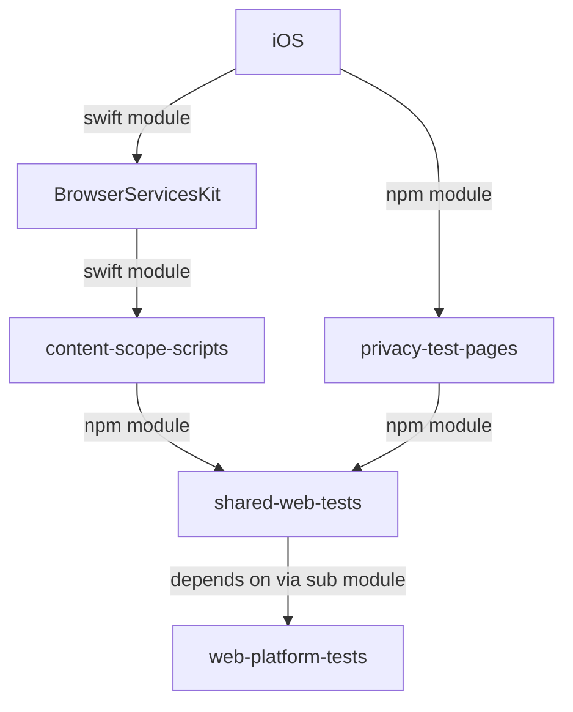

# Shared Web Tests

This repository contains a set of utils to test web applications.
This repo consumes web-platform-tests and exposes it as a simple platform that can be consumed by other projects.
We repackage a few tests and rebuild the manifest.

## Test format


## Running the test server

To start the example test server run the following command:

```bash
npm start
```

## Expected integration



## Setting up the cert

The certificate is generated and used by the test server to serve the tests over https.

See more details: https://web-platform-tests.org/tools/certs/README.html

The client will need to import this root ca to be able to trust the server.

For Apple devices this can be done by running the following command:
```bash
xcrun simctl keychain booted add-root-cert  path/to/shared-web-tests/web-platform-tests/tools/certs/cacert.pem
```