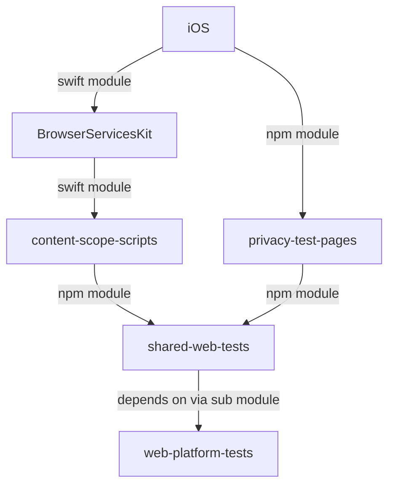

# Shared Web Tests

This repository contains a set of utils to test web applications.
This repo consumes web-platform-tests and exposes it as a simple platform that can be consumed by other projects.
We repackage a few tests and rebuild the manifest.

## Test format


## Running the test server

To start the example test server run the following command:

```bash
npm start
```

We only use the subset of tests that support the web runner: https://wpt-docs.readthedocs.io/en/latest/_running-tests/from-web.html

## Expected integration


```mermaid
graph TD
    SWT[shared-web-tests]
    W[web-platform-tests]
    CSS[content-scope-scripts]
    P[privacy-test-pages]
    I[iOS]
    %% M[MacOS]
    BSK[BrowserServicesKit]
    %% A[Android]


    %% Win[Windows]
    %% Win -- sub module --> CSS
    %% Win -- sub module --> P

    SWT -- depends on via sub module --> W
    CSS -- npm module --> SWT
    BSK -- swift module --> CSS
    %% M -- swift module --> BSK


    %% A -- npm module --> P
    %% A -- npm module --> CSS
    P --  npm module --> SWT
    I -- npm module --> P
    %%M -- npm module --> P
    I -- swift module --> BSK
    %% CSS -- npm module (for manual testing) --> P
    %% P -- sub module --> W
```

## Setting up the host file

https://web-platform-tests.org/running-tests/from-local-system.html#hosts-file-setup

## Setting up the cert

The certificate is generated and used by the test server to serve the tests over https.

See more details: https://web-platform-tests.org/tools/certs/README.html

The client will need to import this root ca to be able to trust the server.

For Apple devices this can be done by running the following command:
```bash
xcrun simctl keychain booted add-root-cert  path/to/shared-web-tests/web-platform-tests/tools/certs/cacert.pem
```


Getting logs from the emulator:
```bash
xcrun simctl spawn booted log show --last 900m --info --debug --predicate 'subsystem == "com.duckduckgo.mobile.ios"' --style compact
```

## Apple WebDriver Testing (iOS & macOS)

### Quick Start

```bash
# Terminal 1: Build the app (first time or after code changes)
npm run build:ios      # or npm run build:macos

# Terminal 1: Start the WebDriver server
npm run driver:ios     # or npm run driver:macos

# Terminal 2: Run the example test (must match the platform from Terminal 1!)
npm run example        # defaults to iOS, or use npm run example:ios / npm run example:macos

# ⚠️ Important: The example command connects to whatever driver is running.
# Make sure you run the matching platform driver and example commands!
# Default is iOS - use npm run example:macos for macOS.

# Or run the full test suite
npm run test:ios       # or npm run test:macos
```

### Options

```bash
# Build from a different apple-browsers location
./scripts/apple-webdriver.sh build ios /path/to/apple-browsers
./scripts/apple-webdriver.sh build macos /path/to/apple-browsers

# Keep the browser open after test completes
./scripts/apple-webdriver.sh example ios --keep
./scripts/apple-webdriver.sh example macos --keep

# Navigate to a specific URL
./scripts/apple-webdriver.sh example ios https://duckduckgo.com
./scripts/apple-webdriver.sh example macos https://duckduckgo.com

# Combine options
./scripts/apple-webdriver.sh example macos https://duckduckgo.com --keep
```

### Environment Variables

- `APPLE_BROWSERS_DIR` - Path to apple-browsers repo (default: `../apple-browsers`)
- `DERIVED_DATA_PATH` - Path to DerivedData containing the built app
- `MACOS_APP_PATH` - Path to macOS app (for macos platform)
- `TARGET_PLATFORM` - Target platform (`ios` or `macos`)
- `PLATFORM` - Platform override (`ios` or `macos`)

### Manual Steps (if needed)

Building the iOS app:

```bash
cd ../apple-browsers
source .maestro/common.sh && build_app 1
```

The iOS app will be built to `apple-browsers/DerivedData/Build/Products/Debug-iphonesimulator/DuckDuckGo.app`

Building the macOS app:

```bash
cd ../apple-browsers
xcodebuild -project macOS/DuckDuckGo-macOS.xcodeproj \
           -scheme "macOS Browser" \
           -derivedDataPath DerivedData \
           -skipPackagePluginValidation \
           -skipMacroValidation
```

The macOS app will be built to `apple-browsers/DerivedData/Build/Products/Debug/DuckDuckGo.app`

Building the WebDriver:

```bash
cd webdriver
cargo build
```

Starting the driver manually:

```bash
# iOS
cd webdriver
DERIVED_DATA_PATH="../../apple-browsers/DerivedData" ./target/debug/ddgdriver --port 4444

# macOS
cd webdriver
MACOS_APP_PATH="../../apple-browsers/DerivedData/Build/Products/Debug/DuckDuckGo.app" \
TARGET_PLATFORM=macos \
DERIVED_DATA_PATH="../../apple-browsers/DerivedData" \
./target/debug/ddgdriver --port 4444
```

Running the example test manually:

```bash
npm run webdriver:example
# or with options
node scripts/selenium-navigate-example.mjs https://duckduckgo.com --keep
```

Running the full suite:

```bash
# iOS
./build/wpt run --product duckduckgo --binary webdriver/target/debug/ddgdriver --log-mach - --log-mach-level info duckduckgo

# macOS
source build/_venv3/bin/activate
export MACOS_APP_PATH="/path/to/DuckDuckGo.app"
TARGET_PLATFORM=macos ./build/wpt run --product duckduckgo --binary webdriver/target/debug/ddgdriver --log-mach - --log-mach-level info duckduckgo
```

### macOS App Setup Requirements

The macOS app must include the automation server. Ensure these files are added to the Xcode project's macOS target:
- `macOS/DuckDuckGo/LaunchOptionsHandler.swift`
- `macOS/DuckDuckGo/Automation/AutomationServer.swift`

The `AppDelegate.swift` must call `startAutomationServerIfNeeded()` in `applicationDidFinishLaunching`.

The automation server reads `automationPort` from UserDefaults. The webdriver automatically detects the bundle ID from the app's Info.plist (handles both release `com.duckduckgo.macos.browser` and debug `com.duckduckgo.macos.browser.debug` builds).