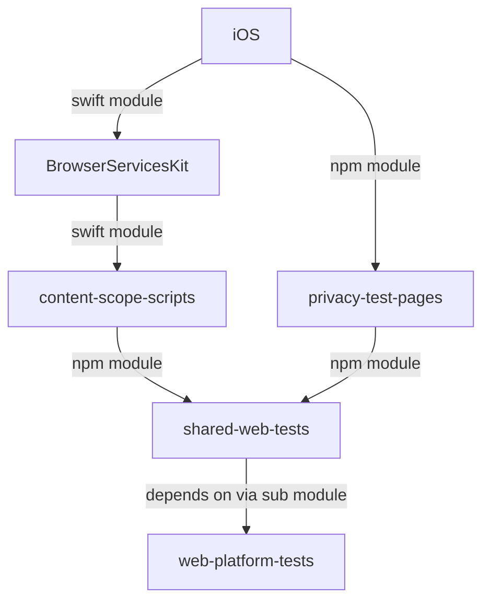

# Shared Web Tests

This repository contains a set of utils to test web applications.
This repo consumes web-platform-tests and exposes it as a simple platform that can be consumed by other projects.
We repackage a few tests and rebuild the manifest.

## Test format


## Running the test server

To start the example test server run the following command:

```bash
npm start
```

We only use the subset of tests that support the web runner: https://wpt-docs.readthedocs.io/en/latest/_running-tests/from-web.html

## Expected integration


```mermaid
graph TD
    SWT[shared-web-tests]
    W[web-platform-tests]
    CSS[content-scope-scripts]
    P[privacy-test-pages]
    I[iOS]
    %% M[MacOS]
    BSK[BrowserServicesKit]
    %% A[Android]


    %% Win[Windows]
    %% Win -- sub module --> CSS
    %% Win -- sub module --> P

    SWT -- depends on via sub module --> W
    CSS -- npm module --> SWT
    BSK -- swift module --> CSS
    %% M -- swift module --> BSK


    %% A -- npm module --> P
    %% A -- npm module --> CSS
    P --  npm module --> SWT
    I -- npm module --> P
    %%M -- npm module --> P
    I -- swift module --> BSK
    %% CSS -- npm module (for manual testing) --> P
    %% P -- sub module --> W
```

## Setting up the host file

https://web-platform-tests.org/running-tests/from-local-system.html#hosts-file-setup

## Setting up the cert

The certificate is generated and used by the test server to serve the tests over https.

See more details: https://web-platform-tests.org/tools/certs/README.html

The client will need to import this root ca to be able to trust the server.

For Apple devices this can be done by running the following command:
```bash
xcrun simctl keychain booted add-root-cert  path/to/shared-web-tests/web-platform-tests/tools/certs/cacert.pem
```


Getting logs from the emulator:
```bash
xcrun simctl spawn booted log show --last 900m --info --debug --predicate 'subsystem == "com.duckduckgo.mobile.ios"' --style compact
```

Building the iOS test build:
```bash
source .maestro/common.sh && build_app
```

Building the web driver API:
```bash
cd webdriver
cargo build
```

Running the suite (iOS):
```bash
./build/wpt run --product duckduckgo --binary webdriver/target/debug/ddgdriver --log-mach - --log-mach-level info duckduckgo
```

## macOS Testing

### Finding your built app

Find existing DuckDuckGo.app builds in Xcode's DerivedData:
```bash
find ~/Library/Developer/Xcode/DerivedData -name "DuckDuckGo.app" -path "*/Debug/*" -type d 2>/dev/null | grep -v iphonesimulator
```

### Running the suite (macOS)

```bash
cd shared-web-tests
source build/_venv3/bin/activate

# Set the path to your built macOS app
export MACOS_APP_PATH="/path/to/DuckDuckGo.app"

# Run with macOS target platform
TARGET_PLATFORM=macos ./build/wpt run --product duckduckgo --binary webdriver/target/debug/ddgdriver --log-mach - --log-mach-level info duckduckgo
```

### macOS App Setup Requirements

The macOS app must include the automation server. Ensure these files are added to the Xcode project's macOS target:
- `macOS/DuckDuckGo/LaunchOptionsHandler.swift`
- `macOS/DuckDuckGo/Automation/AutomationServer.swift`

The `AppDelegate.swift` must call `startAutomationServerIfNeeded()` in `applicationDidFinishLaunching`.

The automation server reads `automationPort` from UserDefaults. The webdriver automatically detects the bundle ID from the app's Info.plist (handles both release `com.duckduckgo.macos.browser` and debug `com.duckduckgo.macos.browser.debug` builds).